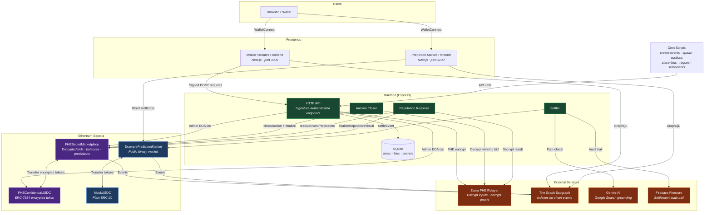
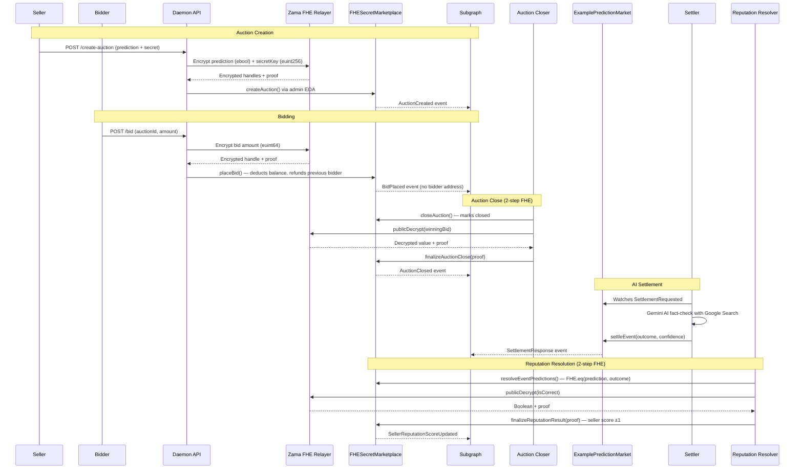

# Insider Streams

Encrypted prediction marketplace built on [Zama fhEVM](https://docs.zama.ai/fhevm) with Fully Homomorphic Encryption (FHE) privacy. Users trade secret predictions on real-world events with encrypted bids, encrypted balances, and pseudonymous identities.

## Links

- [Video](https://www.youtube.com/watch?v=sGsNvkky2xc)
- [Insider Streams frontend](https://insider-streams-insider-streams-fro.vercel.app/)

## Architecture



### Auction Lifecycle



### Contracts (`contracts-fhe/`)

Four Hardhat contracts deployed on Ethereum Sepolia using Zama's fhEVM plugin:

| Contract | Description |
|---|---|
| **FHESecretMarketplace** | Core marketplace — encrypted bids (`euint64`), encrypted balances, pseudonymous user IDs, auction lifecycle, reputation scoring |
| **FHEConfidentialUSDC** | ERC-7984 encrypted payment token for the marketplace |
| **ExamplePredictionMarket** | Public prediction market (plain ERC-20) — events, bets, AI-powered settlement |
| **MockUSDC** | Plain ERC-20 token for the prediction market |

### Daemon (`apps/daemon/`)

Unified Express server with background services:

- **Settler** — watches `SettlementRequested` events, calls Gemini AI with Google Search grounding, settles events on-chain
- **Auction Closer** — polls for expired auctions, closes them, marks winning bids; watches `AuctionCancelled` events
- **Reputation Resolver** — watches `SettlementResponse` events, resolves per-auction predictions against actual outcomes via 2-step FHE decryption
- **HTTP API** — signature-authenticated endpoints (`/user`, `/balance`, `/bid`, `/create-auction`, `/deposit`, `/withdraw`, `/faucet`, etc.)

### Insider Streams Frontend (`apps/insider-streams-frontend/`)

Next.js app (port 3000) — encrypted auction marketplace. Wallet connection (Reown/WalletConnect), Apollo Client for subgraph queries, and daemon API integration. Users create auctions, place encrypted bids, manage balances.

### Prediction Market Frontend (`apps/prediction-market-frontend/`)

Next.js app (port 3100) — public prediction market. Users buy YES/NO shares on events using MockUSDC (plain ERC-20). After purchasing shares, users can create private auctions on the Insider Streams marketplace to sell their signal.

## Deployed Contracts (Eth Sepolia)

| Contract | Address |
|---|---|
| MockUSDC | [`0x1Cd05cf3c20Cd64f6803C1777C6373e47872944c`](https://sepolia.etherscan.io/address/0x1Cd05cf3c20Cd64f6803C1777C6373e47872944c) |
| FHEConfidentialUSDC | [`0x1f54Afd38756089cd2B8852e5014C6ccf1299b57`](https://sepolia.etherscan.io/address/0x1f54Afd38756089cd2B8852e5014C6ccf1299b57) |
| ExamplePredictionMarket | [`0x7C22C1b9B2a4575089a996E98c877b996eBbBAA2`](https://sepolia.etherscan.io/address/0x7C22C1b9B2a4575089a996E98c877b996eBbBAA2) |
| FHESecretMarketplace | [`0xf74884348F7153c63A46a1e362ec6D90E754Cf15`](https://sepolia.etherscan.io/address/0xf74884348F7153c63A46a1e362ec6D90E754Cf15) |

## Quick Start

```bash
pnpm install

# Start the Insider Streams frontend (encrypted marketplace, port 3000)
pnpm dev:insider-streams

# Start the Prediction Market frontend (public market, port 3100)
pnpm dev:prediction-market

# Start the daemon (in a separate terminal)
cd apps/daemon && pnpm start
```

## Demo Scripts

Standalone scripts for populating the marketplace with test data. Run one-shot from `scripts/` or schedule via OS cron:

| Script | Cron | Description |
|---|---|---|
| `pnpm create-events` | `*/15 * * * *` | Generate AI prediction events and place random bets |
| `pnpm spawn-auctions` | `*/10 * * * *` | Create auctions on open events via daemon API |
| `pnpm place-bids` | `* * * * *` | Place bids on open auctions via daemon API |
| `pnpm request-settlements` | `* * * * *` | Request settlement for closed prediction events |

Requires `OWNER_PK`, `TEST_ACCOUNT_1..25`, `RPC_URL`, `VENICE_API_KEY`, and `DAEMON_URL` in `scripts/.env`.

## Testing

```bash
# Daemon unit tests
cd apps/daemon && pnpm test:db       # SQLite bid tracking (11 tests)
cd apps/daemon && pnpm test:e2e      # API E2E tests (52 tests)
cd apps/daemon && pnpm test:sepolia  # Sepolia FHE integration tests
cd apps/daemon && pnpm test:lifecycle  # Full lifecycle E2E (Sepolia, ~3 min)

# Contract tests
cd contracts-fhe && npx hardhat test                  # Local (mock FHE)
cd contracts-fhe && npx hardhat test --network sepolia  # Sepolia (real FHE)

# Frontend Playwright tests
cd apps/insider-streams-frontend && pnpm test:playwright
```

## Project Structure

```
private-streams/
├── apps/
│   ├── insider-streams-frontend/    # Next.js marketplace UI (port 3000)
│   ├── prediction-market-frontend/  # Next.js prediction market UI (port 3100)
│   └── daemon/                      # Express daemon (settler, closer, resolver, API)
├── packages/
│   └── common/                      # Shared ABIs, addresses, utilities
├── contracts-fhe/                   # Hardhat + fhEVM contracts
├── subgraphs/secrets-marketplace/   # The Graph subgraph
├── scripts/                         # Demo scripts, deploy helpers
└── docs/                            # Architecture diagrams, plans
```
