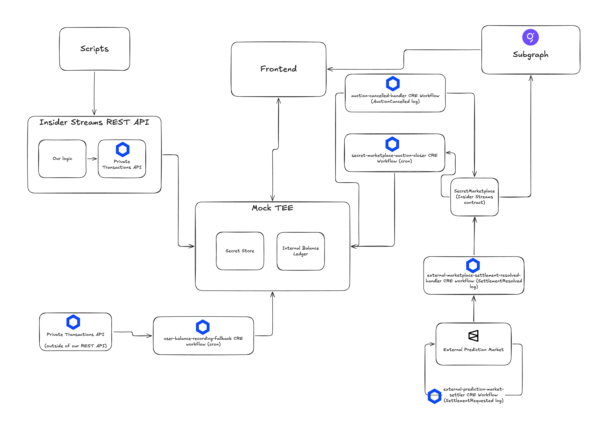

# Insider Streams

## Architecture



## Chainlink prize-track coverage in this repo

This repo uses CRE log triggers, cron triggers, HTTP consensus requests, signed reports, and EVM write reports. That lines up with the current Chainlink hackathon prize areas around `Privacy`, `Prediction Markets`, `Risk & Compliance`, and `DeFi & Tokenization`.

### Chainlink Runtime Environment

We have multiple CRE workflows that broker interactions and synchronize our application and contract state with an "external" prediction market. Although we did develop a demo prediction market for this project, we intentionally disallow direct interactions between our prediction market and our insider streams app, and have clear red lines betwen what is private and public data. We use the CRE as our middleman to navigate those red lines + (simulated) black boxes. If we could use the CRE on mainnet, we **would have built this against Polymarket**.

These are the workflows:

| Workflow                                                                                                              | Trigger                         | Description                                                                                                                                                                                                                                                                                                                                                                                                                                                                   |
| --------------------------------------------------------------------------------------------------------------------- | ------------------------------- | ----------------------------------------------------------------------------------------------------------------------------------------------------------------------------------------------------------------------------------------------------------------------------------------------------------------------------------------------------------------------------------------------------------------------------------------------------------------------------- |
| [auction-cancelled-handler](./cre-workflows/auction-cancelled-handler/)                                               | EVM Log (`AuctionCancelled`)    | If an Auction on Insider Streams is open when its underlying External Prediction Market event resolves, we cancel the Auction on chain and use this CRE workflow to refund the buyer for their bid amount off-chain because the buyer's identity is secret.                                                                                                                                                                                                                   |
| [external-marketplace-settlement-resolved-handler](./cre-workflows/external-marketplace-settlement-resolved-handler/) | EVM Log (`SettlementResponse`)  | Triggered with the outcome of an event from the External Prediction Market is resolved. Updates the seller's reputation score by privately interrogating the Secret Store to see if the seller, with their privileged information, predicted the correct outcome or not                                                                                                                                                                                                       |
| [secret-marketplace-auction-closer](./cre-workflows/secret-marketplace-auction-closer/)                               | Cron (30s)                      | Polls for expired auctions via The Graph subgraph, closes them on-chain via signed CRE report, and settles winning bids in the Secret Store.                                                                                                                                                                                                                                                                                                                                  |
| [user-balance-recording-fallback](./cre-workflows/user-balance-recording-fallback/)                                   | Cron (60s)                      | Polls the Chainlink Compliant Private Token API for transfers to/from the platform EOA and records them as deposits (transfers in) or withdrawals (transfers out) in our Secret Store. Catches transfers made directly through the Private Token API rather than through our REST API.                                                                                                                                                                                        |
| [external-prediction-market-settler](./cre-workflows/external-prediction-market-settler/)                             | EVM Log (`SettlementRequested`) | Listens for SettlementRequests on the external prediction market, queries Gemini AI with Google Search grounding to fact-check the claim, submits the settlement on-chain, and writes an audit trail to Firestore. (Note: Although we believe we modified the contracts sufficiently to be our own, **this workflow is based almost entirely on the workflow from the CRE [prediction-market-demo template](https://docs.chain.link/cre-templates/prediction-market-demo])**) |

Adjacent to the CRE workflows, since we couldn't deploy our CRE workflows during the hackathon, we created a dedicated event polling service to trigger our LogTrigger workflows as though they were live on Chainlink infra in [./apps/event-watcher](./apps/event-watcher)

### Chainlink Confidential Compute / Private Transactions

Private transactions in the app are facilitated w/ our mock USDC token, ["ConfidentialUSDC (CUSDC)"](./contracts/src/ConfidentialUSDC.sol). There are two deployments on Sepolia: the [clear (non-private) CUSDC](https://sepolia.etherscan.io/address/0xee3A0Cccb31fF816615C18E1d1DB480df8a0f9F1) (`0xee3A0Cccb31fF816615C18E1d1DB480df8a0f9F1`) used by the ExamplePredictionMarket, and the [private CUSDC](https://sepolia.etherscan.io/address/0x38EDa3F7b7649CE3f8534C59a40132bE347E750A) (`0x38EDa3F7b7649CE3f8534C59a40132bE347E750A`) registered with the [Chainlink Vault](https://sepolia.etherscan.io/address/0xE588a6c73933BFD66Af9b4A07d48bcE59c0D2d13) for private transfers.

We use the Private Transactions feature of Chainlink Confidential Compute to protect the identities of buyers and sellers when the "deposit" (transfer in) and "withdraw" (transfer out) CUSDC into our app. For moves within our of our app, we update a private ledger of internal balances in our secret store (Supabase) so we can be an escrow for buyers and sellers. This internal ledger is maintained by funneling users through our REST API which manages the Private Transactions complexity, and the [user-balance-recording-fallback](./cre-workflows/user-balance-recording-fallback/) CRE workflow to catch transfers in and out that didn't go through our process.

We use Private Transactions in many places in the app, here's some examples of where it's implemented:

- We created a client for the Private Transactions REST API in [./packages/chainlink-private-token-api-client] that is used in the frontend, the REST API, and scripts
- We use it server side in the frontend to manage our internal ledger of balances, for example in [`requestFundingWithdrawal`](https://github.com/chainlink-convergence/insider-streams/blob/d5cfd7cd72d9b51fdd270890d24609ec588d0fb6/apps/insider-streams-frontend/src/lib/funding/server.ts#L227) which creates a `PrivateTokenApiClient`, executes a `privateTransfer()` to the user's address, and records the withdrawal in our ledger
- We use it client side to allow buyers and sellers to see secrets that they bought/own — the [`PrivateDataProvider`](https://github.com/chainlink-convergence/insider-streams/blob/d5cfd7cd72d9b51fdd270890d24609ec588d0fb6/apps/insider-streams-frontend/src/lib/private-data/private-data-provider.tsx) manages wallet-signed authentication and fetches private bids/secrets, and the [`SecretRevealCard`](https://github.com/chainlink-convergence/insider-streams/blob/d5cfd7cd72d9b51fdd270890d24609ec588d0fb6/apps/insider-streams-frontend/src/components/secret-reveal.tsx) component lets winning bidders reveal the secret data on auction detail pages
- We use it in our [bidding generator script](<[topUpAccount](https://github.com/chainlink-convergence/insider-streams/blob/d5cfd7cd72d9b51fdd270890d24609ec588d0fb6/scripts/place-bids.ts#L228)>) to "deposit" (transfer in) to our internal ledger to generate bidding activity on open auctions in the app

### Prediction Market integration

We've covered the CRE workflows already, but just to reiterate, the main Insider Streams app was designed as though we didn't own the Example Prediction Market. A real prediction market might be on a different chain (Limitless), it might not even be on chain at all (Kalshi). Regardless, of what backend implementation has, the CRE's toolkit for mixing on, cross, and off-chain workflows would work against it.

We did one special thing as a proof of concept however. To show interoperability between multiple systems implementing Chainlink's products, we created a link to create an Auction for secret data immediately after placing a bet on our Example Prediction Market.

We were asked frequently "why would someone sell their secret" when designing the app, and this betting-first approach lets sellers take care of their own before turning over to squeeze even more money out of their alpha with our platform — see the ["Sell your signal" panel in `BuySharesPanel`](https://github.com/chainlink-convergence/insider-streams/blob/d5cfd7cd72d9b51fdd270890d24609ec588d0fb6/apps/prediction-market-frontend/src/components/buy-shares-panel.tsx#L191) which constructs a deep link to create an auction on Insider Streams with the event ID and the seller's bet direction pre-filled. When implementing against Polymarket, we might do this as a browser extension unless we could provide a 3rd party integration.

## Deployed Contracts (Eth Sepolia)

| Contract                   | Source                                                                       | Address                                                                                                                         |
| -------------------------- | ---------------------------------------------------------------------------- | ------------------------------------------------------------------------------------------------------------------------------- |
| ConfidentialUSDC (clear)   | [`ConfidentialUSDC.sol`](./contracts/src/ConfidentialUSDC.sol)               | [`0xee3A0Cccb31fF816615C18E1d1DB480df8a0f9F1`](https://sepolia.etherscan.io/address/0xee3A0Cccb31fF816615C18E1d1DB480df8a0f9F1) |
| ConfidentialUSDC (private) | [`ConfidentialUSDC.sol`](./contracts/src/ConfidentialUSDC.sol)               | [`0x38EDa3F7b7649CE3f8534C59a40132bE347E750A`](https://sepolia.etherscan.io/address/0x38EDa3F7b7649CE3f8534C59a40132bE347E750A) |
| ExamplePredictionMarket    | [`ExamplePredictionMarket.sol`](./contracts/src/ExamplePredictionMarket.sol) | [`0xc0800a96EbfEEd4F7C9113C6D9D960d2D912004f`](https://sepolia.etherscan.io/address/0xc0800a96EbfEEd4F7C9113C6D9D960d2D912004f) |
| SecretMarketplace          | [`SecretMarketplace.sol`](./contracts/src/SecretMarketplace.sol)             | [`0x1f903548234b15C4d955Cce79beaaC853A98C514`](https://sepolia.etherscan.io/address/0x1f903548234b15C4d955Cce79beaaC853A98C514) |

## Quick Start

```bash
pnpm install
pnpm build:contracts
pnpm dev:insider-streams
```

## Create a Prediction Market

### With CRE (automated settlement)

The [external-prediction-market-settler](cre-workflows/external-prediction-market-settler/) CRE workflow listens for `SettlementRequested` events, queries Gemini AI, and settles the market on-chain automatically.

```bash
# Install CRE CLI: https://docs.chain.link/cre/getting-started/cli-installation/macos-linux
# Then simulate the workflow:
cd cre-workflows
cre workflow simulate external-prediction-market-settler --target local-simulation --broadcast
```

See [CRE Workflows README](cre-workflows/README.md) for details.

### Manually (Foundry)

```bash
cd contracts

# Create a market
EXAMPLE_PREDICTION_MARKET_ADDRESS=0xc0800a96EbfEEd4F7C9113C6D9D960d2D912004f \
QUESTION="The New York Yankees won the 2009 World Series." \
forge script script/CreateMarket.s.sol --rpc-url $RPC_URL --broadcast
```

## Create an Auction on SecretMarketplace

```bash
cd contracts

SECRET_MARKETPLACE_ADDRESS=0x1f903548234b15C4d955Cce79beaaC853A98C514 \
EXTERNAL_MARKET_ID=0 \
RESERVE_PRICE=1000000 \
AUCTION_DURATION=120 \
forge script script/secret-marketplace/CreateAuction.s.sol --rpc-url $RPC_URL --broadcast
```

## Close an Auction

### Automatically (CRE workflow)

The [secret-marketplace-auction-closer](cre-workflows/secret-marketplace-auction-closer/) CRE workflow runs on a 30-second cron, detects expired auctions, and closes them via signed report.

```bash
cd cre-workflows
cre workflow simulate secret-marketplace-auction-closer --target local-simulation --broadcast
```

### Manually

```bash
cd contracts

SECRET_MARKETPLACE_ADDRESS=0x1f903548234b15C4d955Cce79beaaC853A98C514 \
AUCTION_ID=0 \
forge script script/secret-marketplace/CloseAuction.s.sol --rpc-url $RPC_URL --broadcast
```

### Cancel Auction (owner only)

Cancels an auction regardless of expiry. Refunds the highest bidder and records the prediction outcome.

```bash
cd contracts

SECRET_MARKETPLACE_ADDRESS=0x1f903548234b15C4d955Cce79beaaC853A98C514 \
AUCTION_ID=0 \
PREDICTION_OUTCOME=0 \
forge script script/secret-marketplace/CancelAuction.s.sol --rpc-url $RPC_URL --broadcast
```

`PREDICTION_OUTCOME`: 0=NoPrediction, 1=PredictionCorrect, 2=PredictionWrong. The `auction-cancelled-handler` CRE workflow handles bid refunds when auctions are cancelled.

## Local Testing Helpers

Four scripts populate the marketplace with test data. The easiest way to run them is the orchestrator:

### Demo orchestrator (`pnpm run-demo`) — recommended

Runs all three population scripts together:

1. **Seed** — runs `create-events` once at startup to create prediction market events
2. **Daemon** — starts `spawn-auctions` and `place-bids` as long-running background processes
3. **Refresh** — re-runs `create-events` every 30 minutes to add fresh events

```bash
cd scripts && pnpm run-demo
```

Prerequisites: frontend dev server running + all env vars set (see individual scripts below). Press Ctrl+C to stop all processes cleanly.

Optional env overrides:

- `CREATE_EVENTS_INTERVAL_MS` — how often to refresh events (default: `1800000` / 30 min)
- `INTERVAL_MS` — spawn-auctions / place-bids cycle interval (default: `300000` / 5 min)
- `BASE_URL` — frontend origin (default: `http://localhost:3000`)

---

### Create prediction market events (`pnpm create-events`)

One-shot script: fetches existing events from the subgraph (for deduplication), asks Venice AI to generate new prediction market questions, creates them on-chain, and places random bets from test accounts.

```bash
cd scripts && pnpm create-events
```

Required env vars in `scripts/.env`:

- `OWNER_PK` — creates events, mints CUSDC
- `TEST_ACCOUNT_1..25` — private keys for bet-placing accounts
- `RPC_URL` — Eth Sepolia RPC
- `VENICE_API_KEY` — Venice AI API key

### Spawn auctions (`pnpm spawn-auctions`)

Long-running daemon that creates one auction per cycle (default: every 5 minutes) against open prediction market events. Picks a random test account and a random canned secret payload each cycle. Skips events that are no longer open and tries the next candidate automatically.

```bash
cd scripts && pnpm spawn-auctions
```

Required env vars in `scripts/.env`:

- `TEST_ACCOUNT_1..25` — private keys for signing auction creation

Optional:

- `BASE_URL` — frontend origin (default: `http://localhost:3000`)
- `INTERVAL_MS` — cycle interval in ms (default: `300000` / 5 min)

The frontend dev server must be running (`turbo run dev --filter=insider-streams-frontend`) since auctions are created via the `/api/create-auction` API route.

### Place bids (`pnpm place-bids`) — debug only

Long-running daemon that places one bid per cycle on open auctions using rotating test accounts. Queries Supabase `private_bids` and `sellers` tables directly to find the current highest bidder and seller — data that is normally secret.

Auto-funds test accounts: if an account's available Supabase balance drops below 100 USDC, a synthetic deposit is inserted directly into the `transfers` table (no on-chain activity). Debug only.

```bash
cd scripts && pnpm place-bids
```

Required env vars in `scripts/.env`:

- `TEST_ACCOUNT_1..25` — private keys for signing bids
- `SUPABASE_URL` — Supabase project URL
- `SUPABASE_SERVICE_ROLE_KEY` — service role key (bypasses RLS)

Optional:

- `BASE_URL` — frontend origin (default: `http://localhost:3000`)
- `INTERVAL_MS` — cycle interval in ms (default: `300000` / 5 min)

## Regenerate Contract Types

After modifying contracts, regenerate TypeScript types, subgraph ABIs, and frontend ABIs:

```bash
./scripts/generate-contract-types.sh          # full pipeline including subgraph deploy
./scripts/generate-contract-types.sh --skip-deploy  # skip subgraph deploy
```

Or just regenerate TypeScript types:

```bash
pnpm wagmi
```

## E2E Tests

```bash
# SecretMarketplace full lifecycle (TypeScript)
pnpm e2e:secret-marketplace

# SimpleMarket + CRE settlement (bash)
./scripts/e2e_tests/simple-market-e2e.sh

# Auction-closer CRE workflow (bash)
./scripts/e2e_tests/secret-marketplace-auction-closer-e2e.sh
```

## Project Structure

```
private-streams/
├── apps/
│   ├── insider-streams-frontend/    # Next.js — main app
│   └── prediction-market-frontend/  # Next.js — settlement history UI
├── packages/common/                 # Shared ABIs, types, contract addresses
├── contracts/                       # Foundry — Solidity contracts
├── cre-workflows/                   # CRE TypeScript workflows
│   ├── external-prediction-market-settler/  # AI-powered market settlement
│   └── secret-marketplace-auction-closer/      # Automated auction closing
├── subgraphs/secrets-marketplace/   # The Graph subgraph
└── scripts/                         # E2E tests and utilities
```

.
